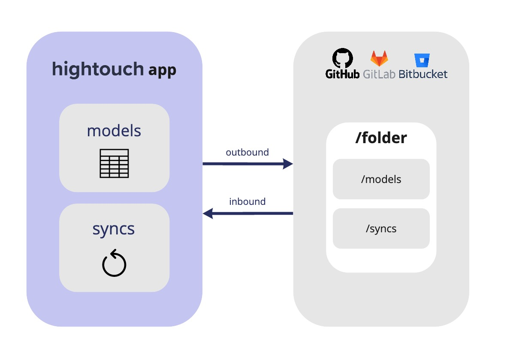

# Hightouch Git Sync Feature

**Git Sync** is a bi-directional sync between your Hightouch workspace and a git repo. When enabled, Hightouch will read from and write to Hightouch schema files within your Git repository as soon as changes are made. 

